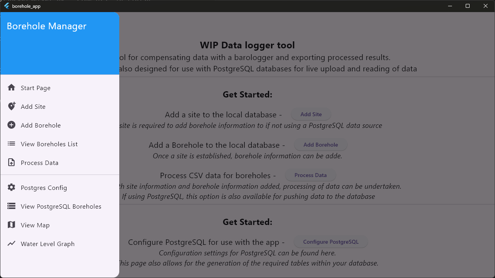
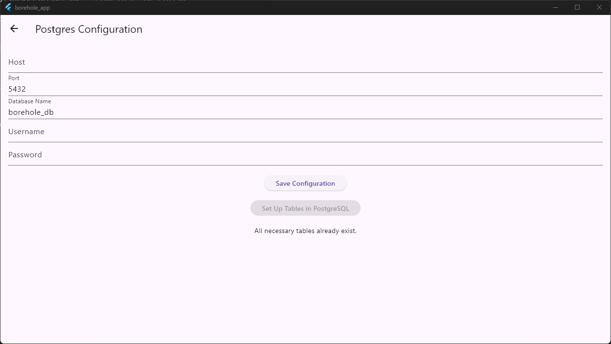
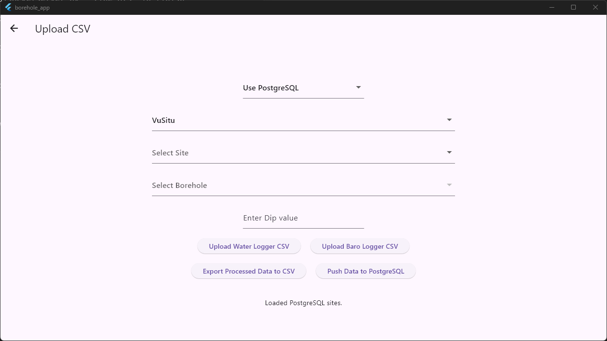
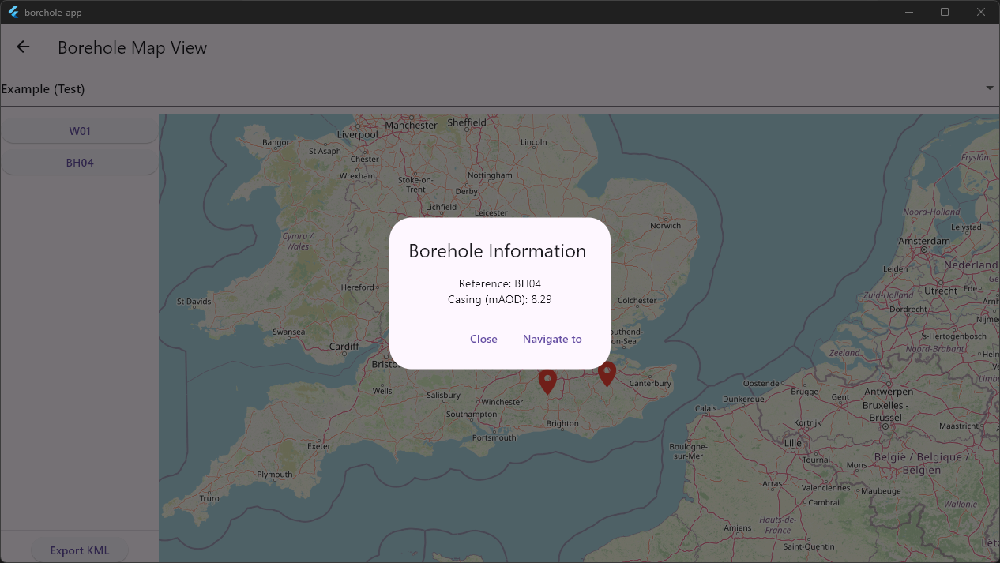
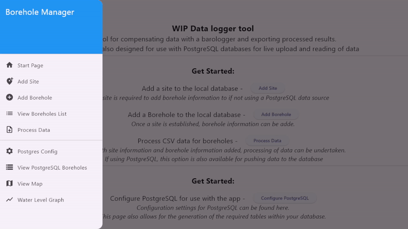

# Borehole Datalogging App\
** This repository contains the code for the [Flutter](https://github.com/flutter/flutter) based application for storing basic information on boreholes and the subsequent processing of datalogger data. ** \

---

## General overview\
The purpose is to allow for management of datalogger datasets in an easy-to-use user interface and remove the need for huge spreadsheets of data.\
The application allows for either built-in database for offline use or the ability to connect to a PostgreSQL database to allow for easy access to data across devices and platforms.\

---

 \
** This project is in development to allow for more data types and more useful outputs from the program. Design is currently also rough for testing features first ** \
The different pages are found in the side-bar for usage.\
\
If using the local database then a site is required to be added and subsequent boreholes. If using this method, only the processing of data works. The visualisation of data and geospatial visualisation currently is designed for PostgreSQL connections.

---

## Using PostgreSQL
 \
The configuration page for PostgreSQL usage requires the host, port, database name and a login for the server running PostgreSQL. \ 
The application uses a fixed table layout. If, once connected, these tables are not detected, the program can add these to the database. The application is now ready to add data.

---

## Processing data
 \
The processing page requires the data source, either PostgreSQL or local. \ 
The type of data logger is required for the processing calculations. \ 
** Currently supports Winsitu and VuSitu datasets. More would like to be added when example data is found. ** \
After this the site and it's child borehole are selected. \
The dip value at the time of download is required for the calculations. Following this, the data will either be stored to PostgreSQL or returned as a processed dataset to the user.

---

## Map visualisation
 \
When using PostgreSQL there is the option to spatially view the site information. When a pin is clicked, a popup displays the basic borehole information. \
There is also the option to export all borehole information as a KML for use in Google Earth which has been preferred by site-workers in the past or the option to navigate using the map service of the device.

---

## Data graph view
 \
Once a site and borehole is selected the graph view will stream the data from PostgreSQL for viewing. A custom date range can be set here and the data will display within the range.

---

** The application has been tested on Windows 11 and Android. Releases can be found [here](https://github.com/Hbm1g18/Borehole-Datalogging-App/releases) **
